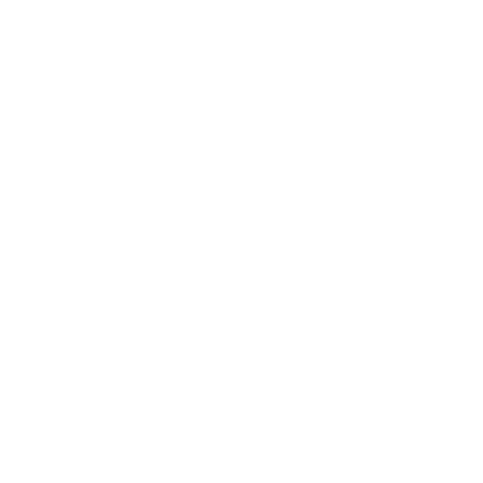

# 

  

**Zenon Engine** is an open-source C++/OpenGL toy engine for Windows that I'll build to reinforce my knowledge about game engine development, modern C++, and graphics programming. This framework should not be used for any production application as the code may potentially contain bugs  

## Getting Started
A compiler with support for C++ 20 is required, so Visual Studio 2019 or 2022 are the recommended versions to work with this engine. As mentioned before, the development will be focused on Windows for now.  

<ins>**1. Downloading the repository**</ins>

Clone the repository with `git clone https://github.com/eddyowen/Zenon`. As explained in the next step, there's no need to clone recursively.

<ins>**2.Install dependencies**</ins>

This project depeneds on Python3 to generate GLAD2 loader code. The commmand to generate **the project files will fail if missing**.

<ins>**3. Configuring the project using the `zen` tool**</ins>

Open a terminal where the repository is located and access the `Scripts` directory. Once in that location, you can execute the `zen` tool the following way:

#### Format
    zen [args]
#### Arguments
    
    gensln  - initializes all the submodules, configures the dependencies and generates the project files.
    opensln - launches Visual Studio and opens the solution.
    clean   - clears project files and deletes build outputs.

